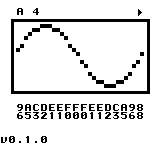
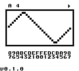
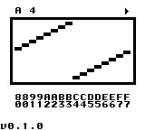
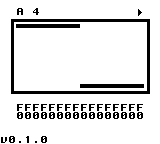

# DummyOSC (Game Boy ROM)

<!--

-->

Simple oscillator for Game Boy with the ability to select waveform and pitch.

## Controls

- `Up` / `Down` - Next / Previous waveform
- `Start` - Play / Stop
- `A` + `Right` / `Left` - Pitch: Next / Previous note
- `A` + `Up` / `Down` - Pitch: Next / Previous octave

## Build from source (Linux)

1. Clone the repository.
2. Build the ROM from source code using the `make` command.

## Screenshots

## Special Thanks

- [GBDK-2020](https://github.com/gbdk-2020/gbdk-2020)
- [Pan Docs](https://gbdev.io/pandocs/)
- [Gameboy Development Forum](https://gbdev.gg8.se/forums/index.php)
